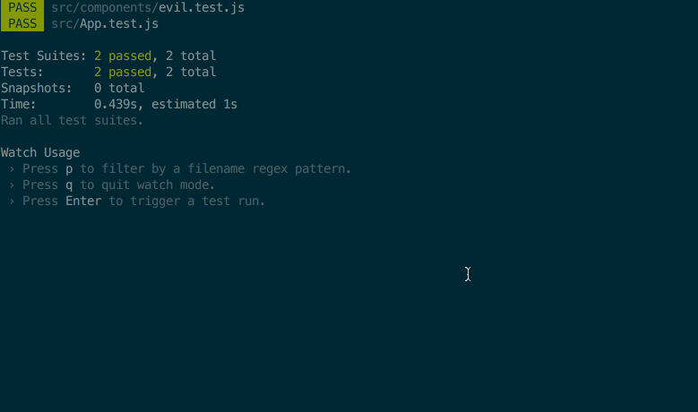

# React Fix It [](https://travis-ci.org/MicheleBertoli/react-fix-it)
Automagically generate tests from errors.

:warning: This package uses [react-component-errors](https://github.com/staxmanade/react-component-errors) to wrap the lifecycle methods into a try...catch block, which affects the performance of your components. Therefore it should **not** be used in production.

## How to use it

- Enhance your components with `fixIt`
- Write some bugs (or wait for your components to fail)
- Open the console and copy the test snippet
- Paste the code to reproduce the error
- Fix the bugs and celebrate

## Demo

[https://michelebertoli.github.io/react-fix-it/](https://michelebertoli.github.io/react-fix-it/)



## Installation

> You can either install it with [npm](https://nodejs.org) or [yarn](https://yarnpkg.com).

```sh
npm install --save-dev react-fix-it
```
or
```sh
yarn add --dev react-fix-it
```

## Example

```jsx
import React, { Component } from 'react'
import fixIt, { options } from 'react-fix-it'

// defaults to console.log
options.log = (test) => {
  console.warn(test)
  doWatheverYouWant(test)
}

class MyComponent extends Component {
  render() {
    return <div>Hello ⚛</div>
  }
}

export default fixIt(MyComponent)
```

:bulb: They easiest way to patch automatically all the components in development mode is by using [babel-plugin-react-fix-it](https://github.com/MicheleBertoli/babel-plugin-react-fix-it) with the following configuration:
```json
{
  "env": {
    "development": {
      "plugins": ["react-fix-it"]
    }
  }
}
```

## Test
```sh
npm test
```
or
```sh
yarn test
```
